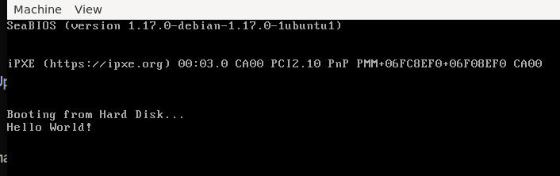
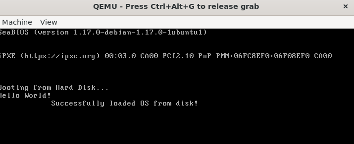
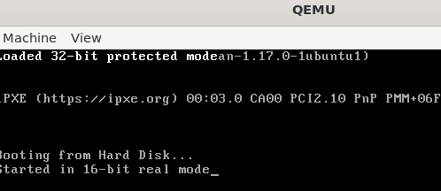

# Devlog Entry

**Title**:  
UPGRADE TO 32 BIT BOOTLOADER

**Date**:  
May 28, 2026

**Version**:  
v0.2

**Devs**:  
ShuaG

---

## Goal:
Go over the initial bootloader since I hadn't touched it in over a year.
upgrade our bootloader to read from the disk and work in 32 bit.

---

## Development:
I started by opening up the project after a long time. I went over all the assembly in the bootloader to make
sure I understood what was going on, installed wsl, nasm and qemu on my new computer and got the bootloader
to print "Hello World!" in 16 bit using the interrupts I used in my first iteration.

Following my recap I worked on upgrading my understanding of assembly by writing the "Hello World!" bootloader
using different methods, ie seperation of files and better written "functions" (I'm not sure what the assembly
term is for this). Following this I moved on to understanding how to read from the second sector (basically 
how to read from the disk) in 16 bit using interrupts.

Once I got reading from the disk to work in 16 bit, I continued on to moving our bootloader from 16 bit to 32
bit. This change means we dont have the option to use BIOS interrupts. The first step in this change was
creating a new print function. Since we couldn't use interrupts, the function needs to go the VGA video's
actual memory and write our text to there. The way it works is one byte represents the letter to be printed,
the second represents the color of the text and background (each is 4 bits). 
After our print functionality the next stage was implementing our GDT table, and finally writing the main for
our 32 bootloader. Our bootloader starts in 16 bit, lets us know and then moves to 32 bit. Currently the 32
bit print function overwrites each time from the top left corner so that may be something to improve on in
the future.
---

## Challenges:
It's been a long time since I touched computer architecture so it took some time to re-adjust to registers
and some of the assembly code. In addition I struggled with remembering the theory behind the code so that is
something I should improve on in the future.

---

## Notes:
 - Try to expand to more than one tutorial.
---

## Result:
It works!

---

## What's Next:
 - Understand the difference between 16 bit and 32 bit from the theoretical side of things.
 - Go over GDTs and understand them.
 - Rewrite the 32 bit bootloader, as it is currently from the tutorial so that I know exactly what is
 happening at each line
 - Move on to the next stage of our OS.

---

## Credit:

Started using the [tutorial](https://github.com/cfenollosa/os-tutorial) by cfenollosa.
